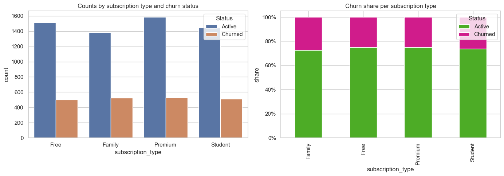

# Präsentation (Suche nach Datasets –  Spotify Churn)

## 1. Spotify Analysis Dataset 2025

### 1.1. Team: ${ \texttt{ jAIm }}$

---

## 2. Brief Description of the Dataset

- **Source**: [Kaggle – Spotify Analysis Dataset 2025 (Apache 2.0)](https://www.kaggle.com/datasets/nabihazahid/spotify-dataset-for-churn-analysis/data)

- **Type**: Synthetically generated dataset for Exploratory Data Analysis (EDA) and Machine Learning (ML)

- **Classification Column**: `is_churned` (0/1)
  
- **Metadata**:

  - **Time Period**: none (synthetic; no real time period)
  
    | **Field**       | **Value**                                                                                                            |
    |----------------:|----------------------------------------------------------------------------------------------------------------------|
    | *Creator*       | nabiha zahid                                                                                                         |
    | *Catalog*       | Kaggle                                                                                                               |
    | *URL*           | [Spotify Dataset for Churn Analysis](https://www.kaggle.com/datasets/nabihazahid/spotify-dataset-for-churn-analysis) |
    | *Published*     | 2025-08-29                                                                                                           |
    | *Last modified* | 2025-08-28                                                                                                           |

- **Data Structure**

  - List of columns with short explanation (e.g., `listening_time`, `skip_rate`, ...)

  - Data types (numeric/categorical)
  
- **Exploratory Results**

  - Target distribution (bar chart)

  - Statistics/boxplots for `listening_time`, `songs_played_per_day`

  - Churn rate by `subscription_type`
  
- **Conclusion**

  - Why suitable for classification

  - Possible next steps (baselines, encoding, fairness note)

---

### 3. About Dataset

### 3.1. [Source](https://www.kaggle.com/datasets/nabihazahid/spotify-dataset-for-churn-analysis/data)

- **Rows**: Each row represents a unique Spotify user.

- **Columns (Features)**:

  - **user_id**: Unique identifier for each user

  - **gender**: User gender (Male/Female/Other)

  - **age**: User age

  - **country**: User location

  - **subscription_type**: Type of Spotify subscription (Free, Premium, Family, Student)

  - **listening_time**: Minutes spent listening per day

  - **songs_played_per_day**: Number of songs played daily

  - **skip_rate**: Percentage of songs skipped

  - **device_type**: Device used (Mobile, Desktop, Web)

  - **ads_listened_per_week**: Number of ads heard per week

  - **offline_listening**: Offline mode usage

  - **is_churned**: Target variable (0 = Active, 1 = Churned)

- **Dataset Type**: Mixed (numeric + categorical)

- **Use Case**: Build machine learning models to predict user churn, analyze engagement patterns, and help Spotify reduce cancellations.

---

### 4. Metadata - Spotify Analysis Dataset 2025 — Metadata Summary

- **Title**: Spotify Analysis Dataset 2025

- **Source/Catalog**: [Kaggle – spotify-dataset-for-churn-analysis](https://www.kaggle.com/datasets/nabihazahid/spotify-dataset-for-churn-analysis)

- **Creator**: nabiha zahid

- **License**: Apache 2.0 (`https://www.apache.org/licenses/LICENSE-2.0`)

- **Publication/Update**: published 2025-08-29; last modified 2025-08-28

- **Access**: isAccessibleForFree = true; isLiveDataset = true

- **Nature of data**: synthetically generated dataset for EDA/ML (no real-world time range)

- **Distribution**:

  - `archive.zip` (~96.839 KB)

  - contains `spotify_churn_dataset.csv` (text/csv)

- **Row semantics**: each row represents a unique Spotify user

- **Target/label**: `is_churned` — 0 = active, 1 = churned

- **Fields (intended types)**:

  - `user_id` (text)

  - `gender` (text)

  - `age` (integer)

  - `country` (text)

  - `subscription_type` (text)

  - `listening_time` (integer, minutes/day)

  - `songs_played_per_day` (integer)

  - `skip_rate` (float)

  - `device_type` (text)

  - `ads_listened_per_week` (integer)

  - `offline_listening` (integer flag)

  - `is_churned` (integer flag)

- **Keywords / use cases**: tabular data; exploratory data analysis; data visualization; classification/logistic regression; churn prediction

---

### 5. Exploratory Results ([Notebook](../notebooks/spotify_churn_eda_executed.ipynb))

